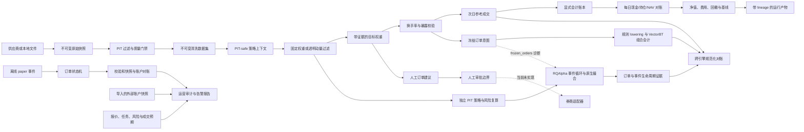

# 架构和安全不变量

## 目标函数

系统第一阶段的目标依次是：

1. 同一份数据、配置和代码产生同一结果。
2. 决策、风险判断、费用和订单变化都可以追溯。
3. 任何未知状态都停止生成可执行建议，而不是猜测。
4. 在研究闭环稳定前，不获得真实账户下单权限。

收益率不是第一阶段的验收目标。无法复现的高收益结果应视为失败。

## 当前链路

模块职责：

| 模块 | 职责 | 明确不负责 |
|---|---|---|
| `config.py` | 严格加载并校验策略和风险配置 | 自动补默认值、保存密钥 |
| `data.py` | 读取价格和持仓，拒绝重复或缺失数据 | 抓取行情、猜测缺失价格 |
| `research.py` | 冻结市场、标的、期限、基准和复权口径 | 决定个人风险偏好 |
| `snapshots.py` | 保存并验证不可变原始快照和许可声明 | 判断上游数据是否可商用 |
| `datasets.py` | PIT 过滤、交易日历、生命周期、事件和质量门禁 | 临时联网补数、向前填充 |
| `providers/` | 将供应商响应规范化后交给快照层 | 被策略或回测直接调用 |
| `risk.py` | 目标股数、整手、换手率门禁 | 预测收益 |
| `backtest.py` | 日线参考模拟、费用、回撤冻结 | 真实盘口撮合 |
| `accounting.py` | 交易和公司行动分录、每日资产对账 | 税务批次、碎股处置 |
| `strategies.py` | PIT-safe 历史上下文、策略决策和证据 | 访问未来数据、直接下单 |
| `independent_policy.py` | 为第二引擎独立复算固定权重/动量决策、目标整手和换手率门禁 | 复用参考策略/风险/回测实现、提交订单 |
| `experiments.py` | 滚动时间折、参数敏感性、执行压力和结果摘要 | 自动调参、证明投资有效性 |
| `cross_engine.py` | 候选引擎契约、输入绑定、文件校验和差异报告 | 生成策略信号、判定投资有效性 |
| `engine_inputs.py` | 严格加载跨引擎共享的冻结行情和订单意图 | 决定成交或读取参考成交 |
| `vectorbt_adapter.py` | 将冻结订单意图 lowering 后交给 VectorBT 复核组合会计 | 独立生成信号、原生复核仓位缩减、盘中撮合 |
| `rqalpha_adapter.py` | 用冻结日线独立生成 PIT 信号并驱动 RQAlpha 原生事件、撮合、费用和账户 | 真实盘口、券商执行、证明策略有效 |
| `scenarios.py` | 确定性合成市场和故障场景 | 模拟真实收益分布 |
| `orders.py` | 生成可审阅订单计划 | 下单、撤单、修改账户 |
| `execution/paper.py` | 离线订单事件、幂等、状态恢复和账户对账 | 联网、生成成交、券商真相源 |
| `execution/audit.py` | 行情/任务新鲜度、成交偏差和导入账户快照对账 | 验证快照来源、通知投递、修改账户 |
| `artifacts.py` | 保存输入指纹、结果和假设 | 将数据上传到外部服务 |

## 安全不变量

- 配置只接受 `manual` 和 `paper`，任何 `live` 值都会加载失败。
- 策略层只产生目标持仓，不持有券商客户端、账号或 Token。
- 信号日和执行日分离，不能用未来日期的价格生成当前信号。
- 策略只能通过 `HistoricalContext` 获取 `as_of` 及之前的价格；越界访问立即
  失败。
- 每次策略计算产生稳定 `decision_id`，并保存目标权重、证据和诊断信息。
- 动态策略预热不足时阻断调仓，不能将未知状态解释成零仓位。
- M1 数据集只保留 `available_at <= as_of` 的记录。
- 研究范围必须声明使用供应商发布时间还是严格本地观察时间；后者不允许用
  事后抓取的快照回放过去。
- 原始响应、研究范围或辅助输入改变时必须产生新 ID，禁止覆盖旧版本。
- 回测只读取质量状态为 `pass` 且文件哈希完整的数据集。
- 输入标的缺价时整次运行失败，不做向前填充。
- 数据集标记停牌时不成交，人工订单计划直接阻断。
- 复权数据集不能生成订单计划；订单参考价必须是未复权可执行价格。
- 策略外持仓不会被自动卖出，而是使订单计划进入 `blocked`。
- 订单计划永远要求人工审批，且声明不允许自动执行。
- 最大回撤只冻结后续调仓，不隐式触发清仓。
- 每次运行保存配置和数据的 SHA-256，修改输入就会产生不同指纹。
- v0.7+ 回测 manifest 还锚定每个结果文件的 SHA-256；跨引擎验证拒绝没有该映射
  或任一结果文件验哈希失败的参考运行。
- M1 回测额外保存数据集 manifest 和源快照 ID。
- M1.5 实验强制 train、validation、test 按时间排列且互不重叠，并对同一决策
  逻辑执行成本和延迟压力测试。
- M2 多折实验要求各折的测试窗口持续向未来推进；参数扰动只输出描述性结果，
  不自动挑选事后最优参数。
- 跨引擎候选必须绑定参考输入和结果哈希；对账前不得读取参考成交来决定候选成交。
- 事件驱动候选的订单和事件文件必须成对存在并参与 candidate ID；事件序号、
  状态迁移、累计成交、费用、终态和规范化成交必须互相一致。
- 独立策略候选必须包含参与 candidate ID 的 `signals.csv`；决策状态、ID、目标
  权重、PIT 证据、换手率和拟议订单必须与参考信号逐项对账。
- 跨引擎 `pass` 只覆盖 manifest 声明的执行与会计范围，始终保持
  `investment_validity_established=false` 和 `automatic_execution_allowed=false`。
- 未复权价格中的公司行动必须显式入账；复权数据只记录事件，禁止重复改变资产。
- 待执行订单跨越未复权拆并股时必须拒绝，不能沿用已经失真的股数。
- 每个回测交易日必须从账本独立重建现金、持仓和 NAV，误差立即中止运行。
- Paper 事件 ID、客户订单 ID、柜台订单 ID 和成交 ID 都有幂等或唯一性约束；
  状态快照必须通过内容哈希、账户重建和完整事件回放校验后才能恢复。
- 离线 paper 状态明确禁止自动执行，也不伪装成券商或模拟柜台状态。
- Paper 运营审计拒绝无时区时间、未来观测和未知字段；报告绑定 Paper 状态、
  审计输入和自身哈希。
- 活动订单缺报价、报价过期、任务失败、风险冻结、订单老化、成交偏差或账户
  差异都产生显式告警；critical 告警使报告进入 `blocked`。
- fixture 外部账户只能验证数据契约，不能被解释成券商恢复真相源；审计结果
  无论是否通过都不改变 `automatic_execution_allowed=false`。

## 扩展约束

后续策略应实现“历史上下文 -> 目标权重”，不能直接调用执行 API。券商适配
必须位于独立的 `execution` 边界，并至少实现：

- 幂等客户端订单号。
- 下单前账户和持仓重新对账。
- 委托、部分成交、拒单、撤单和超时状态机。
- 行情过期、账户不一致和网络异常时 fail closed。
- 单日资金上限、订单上限和一键停止。
- 操作日志与策略决策快照关联。

在实现真实适配器前，应再次核对当期监管规则和开户券商要求。可从
[证监会程序化交易规定](https://www.csrc.gov.cn/csrc/c100028/c7480577/content.shtml)
以及对应交易所、券商的最新规则开始确认。
